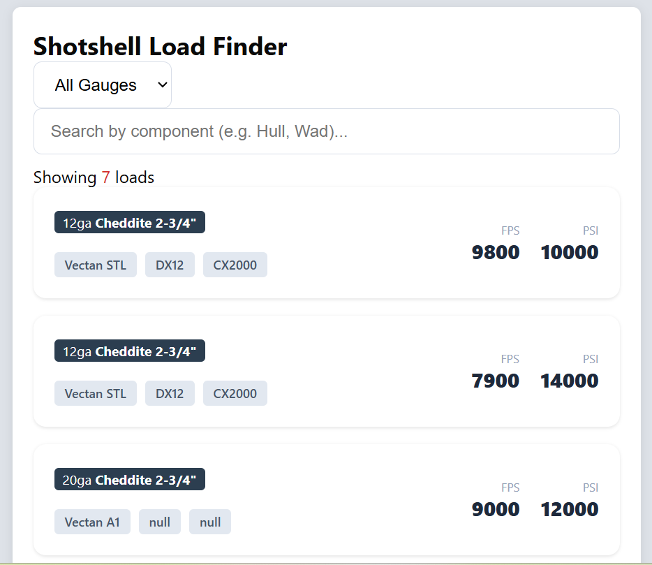
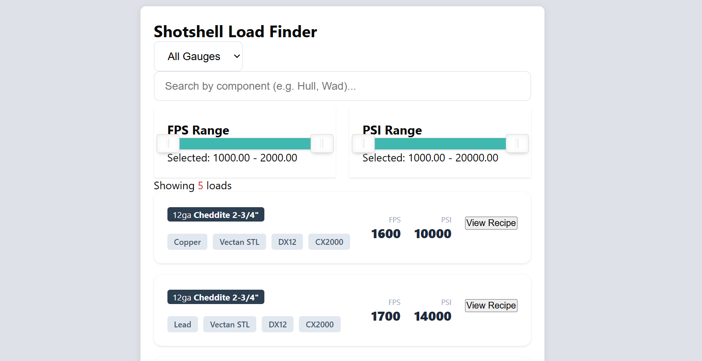

# Ballistic Load Finder 🎯
A modern, high-performance search tool for shotshell reloading data.

## 🛠️ The Tech Stack
- **Frontend:** Vanilla JavaScript (ES6+), HTML5, CSS3 (Flexbox/Grid)
- **Backend:** Supabase (PostgreSQL)
- **Security:** Row Level Security (RLS) policies for public data access

## ✨ Key Features
- **Instant Search:** Real-time filtering by hull, powder, or gauge.
- **Clean UI:** Card-based layout designed for high scannability of technical specs.
- **Dynamic Data:** Connected to a live Supabase database for instant updates.

## 🚀 Local Setup
1. Clone the repo: `git clone https://github.com/ElliotFackler/ballistic-load-finder.git`
2. Copy `config.example.js` to `config.js`.
3. Enter your own Supabase credentials in `config.js`.
4. Open `search.htm` in any modern browser.

## 🛡️ Security Note
This project utilizes Supabase RLS to ensure that the public has read-only access to the load data, protecting the database integrity.

## Planned items
* Add more filters drop-down menu
* Add slider for FPS and PSI
* Add read more to link to load specific articles.

## Gallery

  <table>
    <tr>
      <td></td>
      <td></td>
    </tr>
    <tr>
      <td align="center"><b>First Edition View</b></td>
      <td align="center"><b>Current View</b></td>
    </tr>
  </table>

